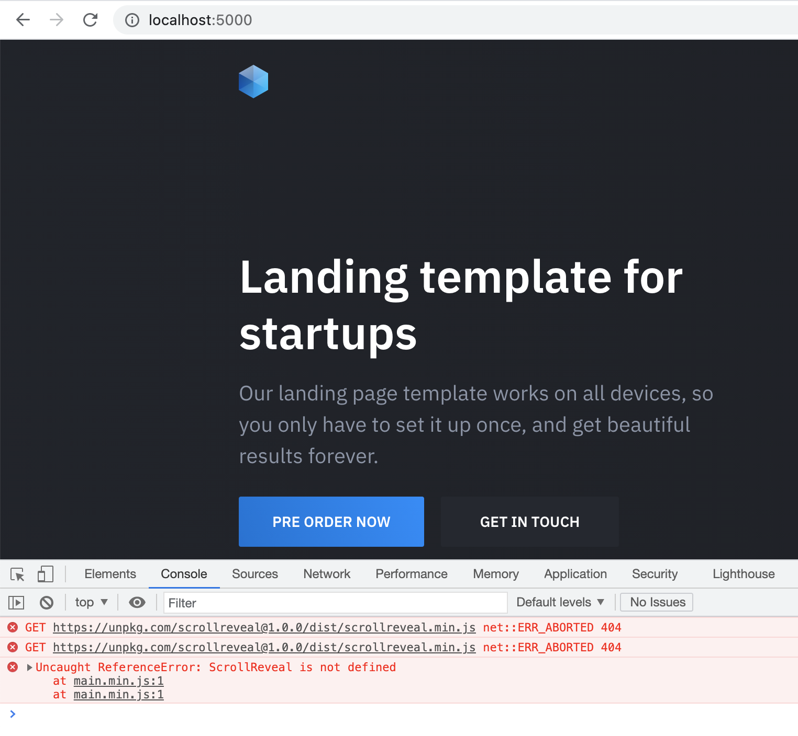
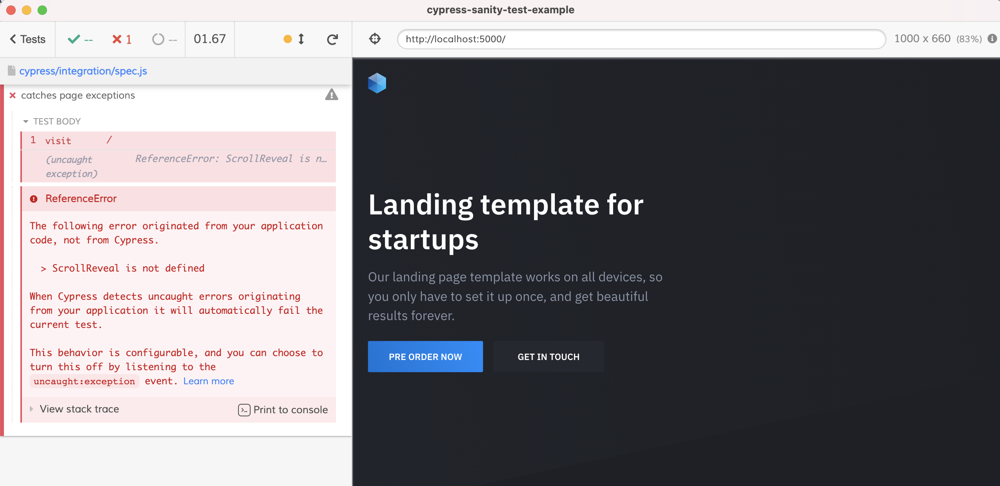

# cypress-sanity-test-example
> Catching JavaScript exceptions and 404 resources using Cypress

The static landing page downloaded from [cruip.com](https://cruip.com/demos/solid/) via [40 Free HTML landing page templates](https://dev.to/davidepacilio/40-free-html-landing-page-templates-3gfp).

## The errors

I have introduced two errors into the page: a JavaScript reference error, and a 404 by changing a line in [public/index.html](./public/index.html)

```diff
- <script src="https://unpkg.com/scrollreveal@4.0.0/dist/scrollreveal.min.js"></script>
+ <script src="https://unpkg.com/scrollreveal@1.0.0/dist/scrollreveal.min.js"></script>
```



## Install and use

```shell
npm install
```

Then start the site with `npm start`. You can open Cypress with `npm run cy:open` from another terminal.

**Tip** there is [start-server-and-test](https://github.com/bahmutov/start-server-and-test) utility already installed, thus you can simply do `npm run dev` to serve the site and open Cypress.

## Tests

You can find all tests in [cypress/integration/spec.js](./cypress/integration/spec.js) file.

### Catching errors

Cypress fails the test by default if it detects application errors or unhandled rejected promises, see [docs.cypress.io](https://docs.cypress.io/). Just visiting the page will catch the reference error.

```js
it('catches page exceptions', () => {
  cy.visit('/')
})
```


